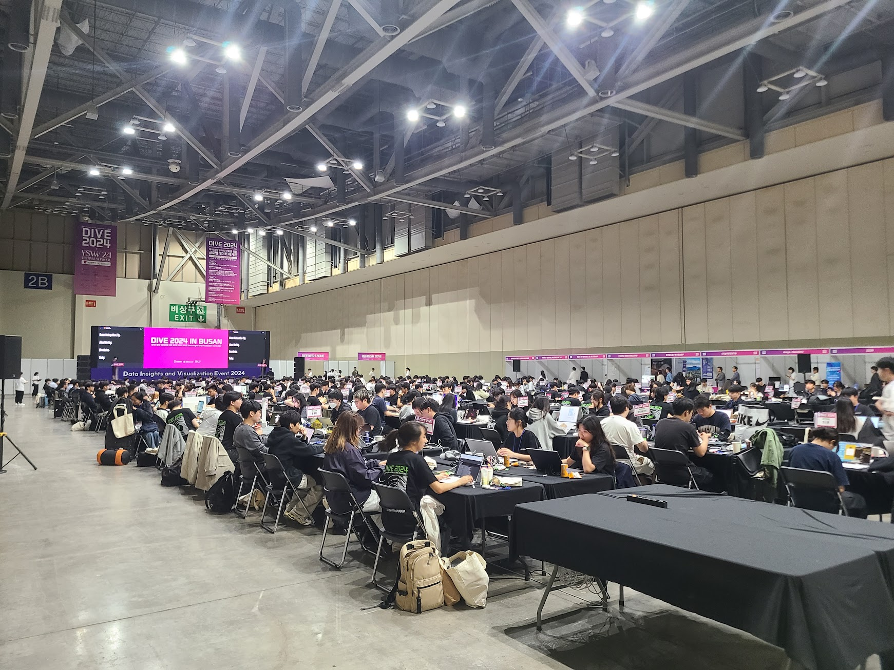
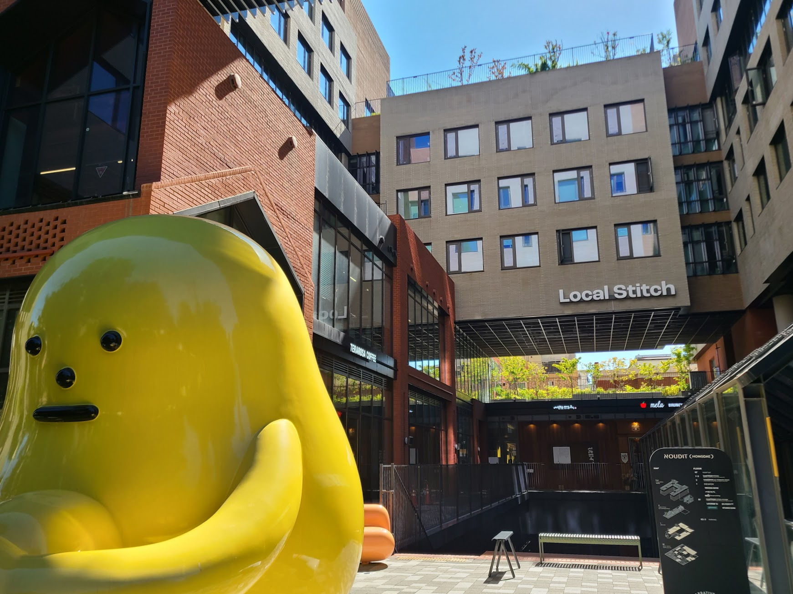
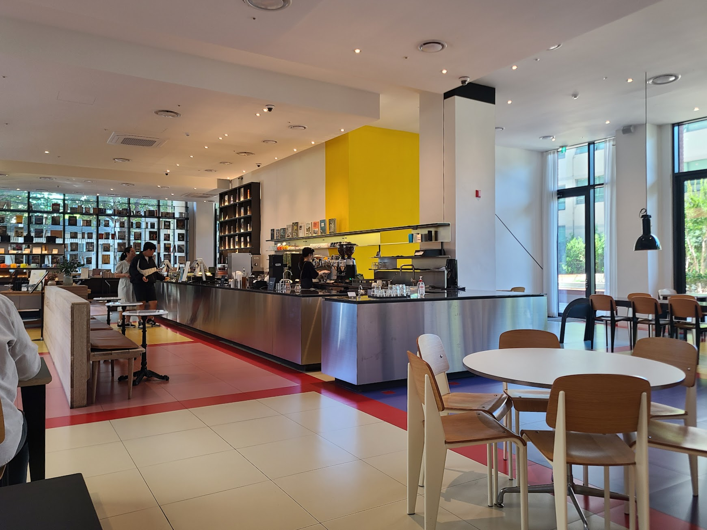
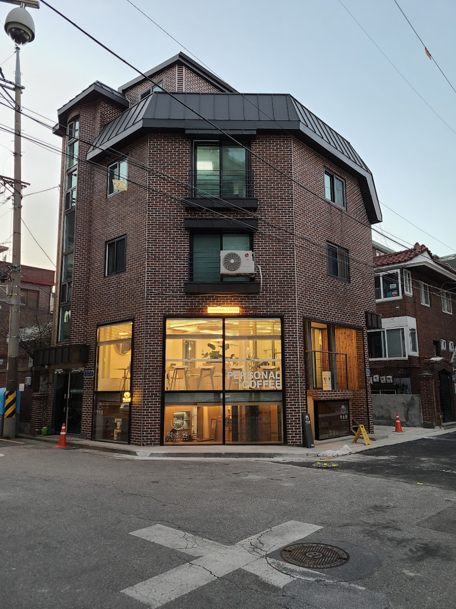
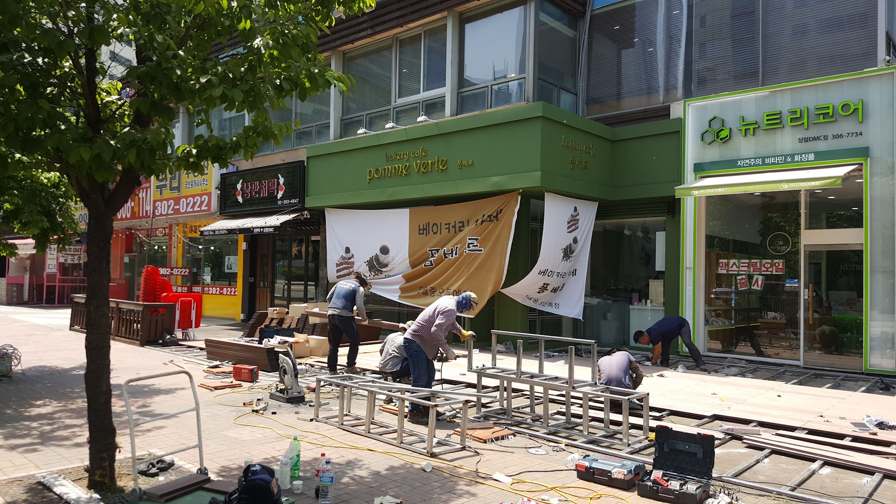

## 문제 1

Q: 다음 이미지에 대한 설명 중 옳지 않은 것은 무엇인가요?
- (1) 많은 사람들이 큰 홀에 앉아 있습니다.
- (2) 중앙에 있는 스크린은 "DIVE 2024 IN BUSAN"이라는 문구를 보여주고 있습니다.
- (3) 사람들은 대부분 노트북을 사용하고 있습니다.
- (4) 이미지 속에 있는 모든 사람들은 서 있을 뿐입니다.

Listening: Which of the following descriptions of the image is incorrect?
- (1) Many people are seated in a large hall.
- (2) The central screen displays the phrase "DIVE 2024 IN BUSAN."
- (3) Most people are using laptops.
- (4) Everyone in the image is standing.

정답: (4) 이미지 속의 대부분의 사람들은 앉아 있습니다.

----------------------

## 문제 2

Q: 다음 이미지에 대한 설명 중 옳지 않은 것은 무엇인가요?
- (1) 건물 외벽에 "Local Stitch"라는 글자가 보입니다.
- (2) 노란색 조형물이 이미지의 왼쪽에 위치해 있습니다.
- (3) 벽돌로 된 건물이 보입니다.
- (4) 이미지 오른쪽에 빨간색 조형물이 있습니다.

Listening: Which of the following descriptions of the image is incorrect?
- (1) The exterior wall of the building has the words "Local Stitch" on it.
- (2) A yellow sculpture is positioned on the left side of the image.
- (3) There is a brick building visible.
- (4) There is a red sculpture on the right side of the image.

정답: (4) 이미지 오른쪽에는 빨간색 조형물이 아닌 다른 색상의 조형물이 있습니다.

----------------------

## 문제 3

Q: 다음 이미지에 대한 설명 중 옳지 않은 것은 무엇인가요?
- (1) 카페 내부의 모습이 담겨 있습니다.
- (2) 직원이 에이프런을 착용하고 있습니다.
- (3) 노란색 벽이 눈에 띕니다.
- (4) 모든 테이블이 고객으로 가득 차 있습니다.

Listening: Which of the following descriptions of the image is incorrect?
- (1) It shows the inside of a café.
- (2) An employee is wearing an apron.
- (3) There is a noticeable yellow wall.
- (4) All tables are full of customers. 
        
정답: (4) 모든 테이블이 고객으로 가득 차 있는 것이 아니라 일부 테이블은 비어 있습니다.

----------------------

## 문제 4

Q: 다음 이미지에 대한 설명 중 옳지 않은 것은 무엇인가요?
- (1) 건물 1층에 커피 전문점이 있습니다.
- (2) 건물 외벽은 벽돌로 마감되어 있습니다.
- (3) 건물 옥상에 큰 나무가 서 있습니다.
- (4) 건물의 각 층에는 창문이 보입니다.

Listening: Which of the following descriptions of the image is incorrect?
- (1) There is a coffee shop on the first floor of the building.
- (2) The exterior of the building is finished with brick.
- (3) There is a large tree on the roof of the building.
- (4) Windows are visible on each floor of the building.

정답: (3) 건물 옥상에 큰 나무가 서 있지 않습니다.

----------------------

## 문제 5

Q: 다음 이미지에 대한 설명 중 옳지 않은 것은 무엇인가요?
- (1) 다양한 빵이 진열된 모습이 보입니다.
- (2) 가게의 벽에는 하얀 타일이 장식되어 있습니다.
- (3) 점원이 초록색 모자를 쓰고 있습니다.
- (4) 유리 진열장 안에 빵 가격표가 있습니다.

Listening: Which of the following descriptions of the image is incorrect?
- (1) Various breads are displayed.
- (2) The shop's wall is decorated with white tiles.
- (3) The employee is wearing a green cap.
- (4) There are price tags for the bread inside the glass display.

정답: (3) 점원은 초록색 모자가 아닌 흰색 모자를 쓰고 있습니다.

----------------------

## 문제 6

Q: 다음 이미지에 대한 설명 중 옳지 않은 것은 무엇인가요?
- (1) 사람들이 건물 앞에서 공사를 하고 있습니다.
- (2) "bakery cafe pomme verte"라는 간판이 보입니다.
- (3) 오른쪽 가게는 비어 있는 상태입니다.
- (4) 바닥에 공사 장비들이 놓여 있습니다.

Listening: Which of the following descriptions of the image is incorrect?
- (1) People are doing construction work in front of a building.
- (2) There is a sign that says "bakery cafe pomme verte."
- (3) The store on the right is empty.
- (4) There are construction tools on the ground.

정답: (3) 오른쪽 가게는 비어 있는 상태가 아닙니다.

----------------------

## 문제 7

----- 퀴즈 -----

Q: 다음 이미지에 대한 설명 중 옳지 않은 것은 무엇인가요?
- (1) 넓은 창문을 통해 자연광이 들어오고 있습니다.
- (2) 방의 바닥은 타일로 되어 있습니다.
- (3) 사람들이 테이블에 앉아 대화를 나누고 있습니다.
- (4) 천장에 조명이 설치되어 있습니다.

Listening: Which of the following descriptions of the image is incorrect?
- (1) Natural light is coming through large windows.
- (2) The floor of the room is made of tiles.
- (3) People are sitting at tables and having conversations.
- (4) There are lights installed on the ceiling.

정답: (2) 방의 바닥은 타일이 아닌 나무로 되어 있습니다.

----------------------

## 문제 8

Q: 다음 이미지에 대한 설명 중 옳지 않은 것은 무엇인가요?

- (1) 사람들이 큰 버스 앞에 줄을 서 있습니다.
- (2) 한 사람이 전화를 걸고 있는 모습이 보입니다.
- (3) 배경에 커다란 건물이 보입니다.
- (4) 사람들은 공원에서 산책 중입니다.

Listening: Which of the following descriptions of the image is incorrect?

- (1) People are lining up in front of a big bus.
- (2) There is a person making a phone call.
- (3) A large building is visible in the background.
- (4) People are taking a walk in a park.

정답: (4) 사람들은 공원에서 산책 중이 아니라, 버스 앞에 모여 있습니다.

----------------------

